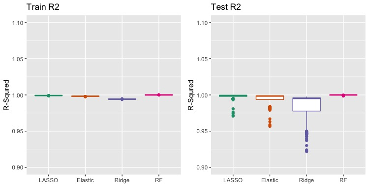
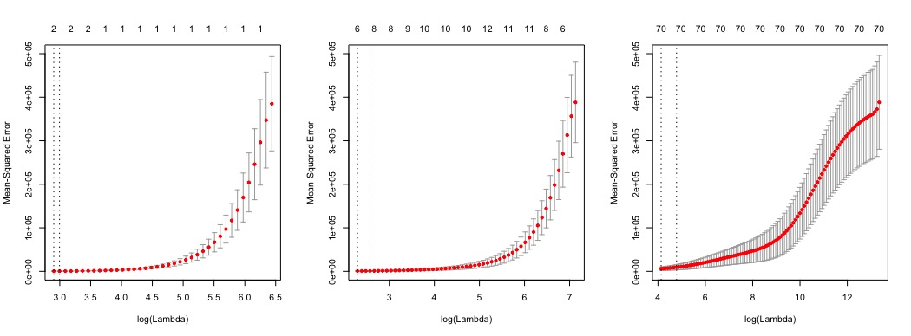
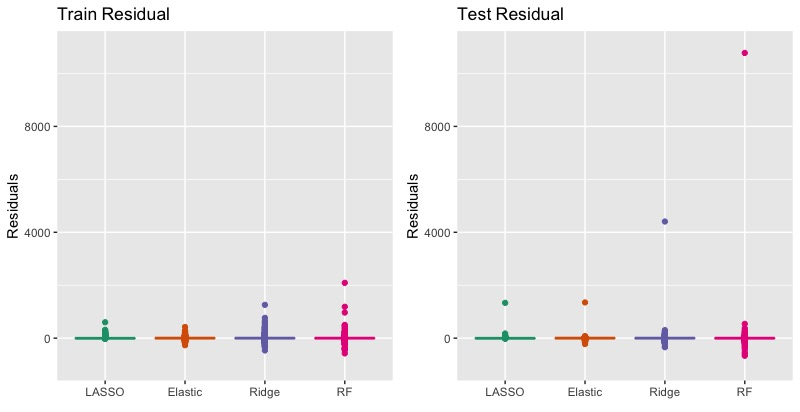
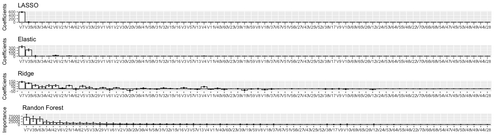
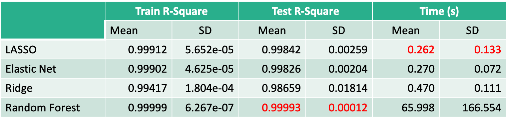

# Buzz prediction on Twitter
The goal is to predict the number of active discussions about a tweet.

- Language: R 
  - Libraries: ggplot2, glmnet, randomForest, reshape, gridExtra, dplyr, MASS
- Supervised learning: regression
  - LASSO, Ridge, Elastic net, Random forest, Cross-validation, Bootstrap
- [Slides](Buzz_prediction.pdf)
- [Dataset](twitter.csv)
- [Source Code](STA9890_Project_r1.R)

## Purpose

The target variable is the number of active discussion(NAD) in 6 weeks after a tweet is created.

If the target is well predicted, we can pay attention to emergent issues such as covid-19 and wildfire, act proactively, and minimize possible damages. 
If we set the threshold, this dataset can be used for binary classification: Buzz detection on Twitter

In order to figure out the best model, we iteratively compute test 
R-sqaures 100 times and compare them by boxplot as below.

## Dataset

The size is n  = 5832 samples. This dataset has p = 70(except target variable)
predictors without any no missing data. Predictors have 10 types in 
different time frames such as Number of Created Discussions, Author 
Increase, and Attention Level.

Train dataset is 80% of n, and test dataset 20%.

## R-sqaures

All the models shows the good prediction on the target variable because 
test R-sqaures is close to 1 even though any fabricated varible isn't 
added to the dataset. That is, residual sum of squares is almost 0.

There is a pattern in R-sqaures which we expected. Train R-sqaures is worse
than test R-sqaures, which can be called overfitting when it's severe. 
However, all the models aren't overfitted because the most severe one's 
R-sqaures is over 0.9. Random forest results in the best performance 
among them since train R-sqaures and test R-sqaures is almost the same. 
Ridge is the most severe.

## Cross-validation MSE curve

Cross-validation is used to optimize the hyperparameter of LASSO, 
Elastic net, and Ridge. As shown above, LASSO takes only two variables,
Elastic net six, and Ridge all the variables.

In general, elastic net has the lowest variance in cv mse and 
ridge the largest.

Ridge results in the worst MSE as the test R-sqaures is the worst 
for Ridge.

## Residuals

Models tend to predict the target much lower than the true value 
as the absolute value of positive residuals is way larger than 
that of negative ones. Test residual has more spread. Variance would 
be much greater because it’s squared.

## Estimated coefficients

To estimate coefficients, bootstrap is used.

Variable coefficients are ordered by the absolute values. 4 models have 
in common Top 2 variables that has the largest coefficient: V7 - # 
of created discussions, V35 – # of atomic containers in the same topic.
Ridge and Random Forest select V63 as the third: contribution sparseness.
Ridge has lower coefficients than lasso and elastic net because ridge 
doesn't have any zero coefficient. Random Forest has more spread 
in variable importance than others.

## Conclusion

In general, all the models result in good performance.

The best model is **Random Forest** considering the trade-off between 
time and performance because average time to model is just around 
1 minute and Random Forest has the largest mean and least SD in 
test R-square. Ridge is the worst in terms of performance.

**Top 2 variable that the most predict the target are in common.**
